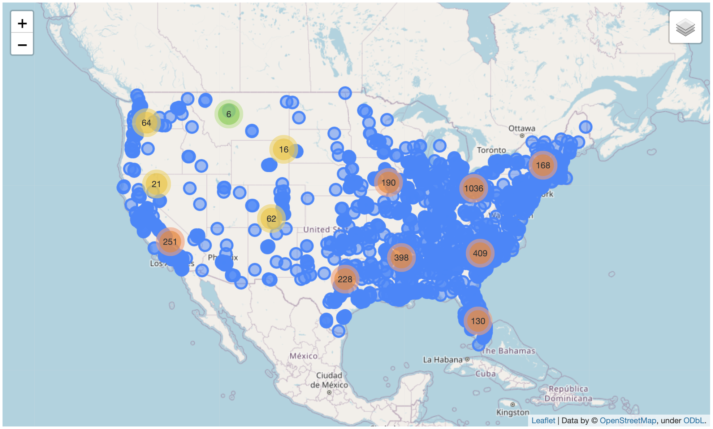

# Gun Violence in the US: Data Analysis

An analysis of five years of US gun violence data (2013–2018), mapping where
incidents happen and how the numbers moved over time.

  

**[Interactive report with the live map →](https://harsh-verma-io.github.io/Gun-Violence-in-US-Data-Analysis/)**

---

## The data

[Kaggle: Gun Violence Data](https://www.kaggle.com/jameslko/gun-violence-data),
covering January 2013 to March 2018.

According to the CDC, one person is killed by a firearm every 17 minutes, 87
people are killed on an average day, and 609 are killed every week. These
deaths are a predictable outcome of underinvestment in prevention approaches
that work. Analysis that draws on evidence, and looks at the factors raising or
lowering risk in the communities most affected, is where prevention starts.
